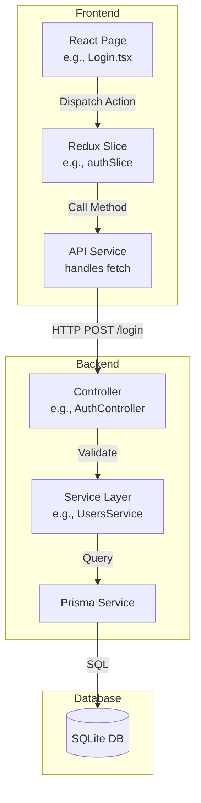
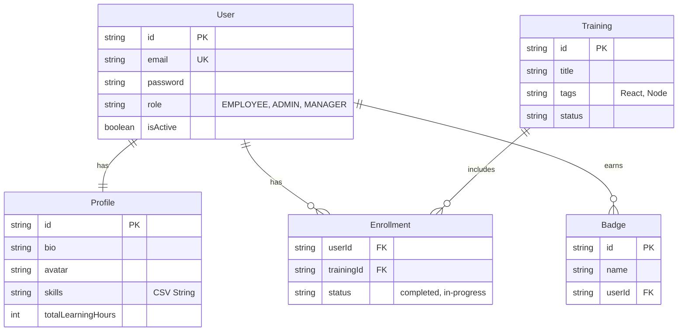

# 🏗️ L&D Portal Architecture

## High-Level System Architecture

The L&D Portal follows a modern **Client-Server** architecture.

```mermaid
graph TD
    User((User))
    Browser[Web Browser]
    
    subgraph "L&D Portal System"
        Frontend[Frontend Application\n(React + Vite)]
        Backend[Backend API\n(NestJS)]
        DB[(Database\nSQLite)]
    end

    User -->|Interacts with| Browser
    Browser -->|Serves| Frontend
    Frontend -->|JSON/REST API| Backend
    Backend -->|read/write| DB
```

---

## Detailed Component Architecture

### 1. Frontend Layer (Client)
*   **Framework**: React 18 built with Vite.
*   **State Management**: Redux Toolkit (Slices for Auth, Users, Trainings).
*   **Styling**: Tailwind CSS with custom "Glassmorphism" utilities.
*   **Routing**: React Router DOM (Protected Routes via `RequireAuth`).

### 2. Backend Layer (Server)
*   **Framework**: NestJS (Modular, Dependency Injection).
*   **Authentication**:
    *   **Custom Guard**: `AuthGuard` (Mock/JWT hybrid).
    *   **Login Logic**: Supports standard (Bcrypt) and Quick Login (Flag-based).
*   **ORM**: Prisma (Type-safe database client).



---

## Database Schema (ER Diagram)

The data model centers around the `User` who has a `Profile` and `Enrollments` in `Trainings`.


